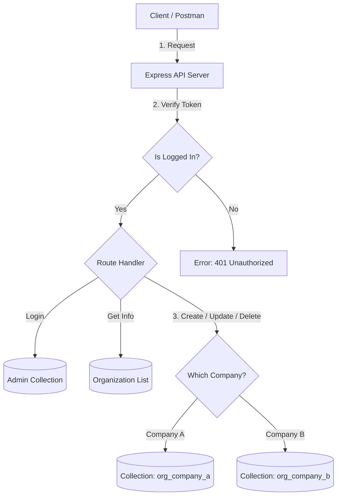

# 🏢 Organization Management Service

A backend service built with **Node.js** and **MongoDB**. It allows you to create different organizations (companies). Each company gets its own private storage space (collection) in the database, so their data never mixes with others.

## 🏗️ How It Works (Architecture)

I used a design where every organization gets its own "folder" (collection) in the database.


## 💡 Design Choices (Why I built it this way)

### 1. Separate Collections for Each Company
* **The Choice:** Instead of putting everyone's data in one big list, I make a new collection for every new company (e.g., `org_tesla`, `org_spacex`).
* **Why:** This is safer. It ensures one company can never accidentally see another company's data. It is like giving every company their own private notebook.

### 2. Flexible Storage
* **The Choice:** I set the company collections to be "flexible" (strict: false).
* **Why:** Different companies might want to save different things. One might save "Products" and another might save "Invoices". This design lets them save whatever data they need without errors.

### 3. Direct Database Renaming
* **The Choice:** When updating an organization's name, I talk directly to the database to rename their collection.
* **Why:** It is much faster and safer than trying to copy data manually. It ensures no data is lost during a name change.

### 4. Security First
* **The Choice:** I used **bcrypt** to scramble passwords and **JWT** for digital ID cards (tokens).
* **Why:** We never store plain passwords in the database. If the database is stolen, the hackers still can't read the passwords.


## 🚀 Instructions to Run the Application

Follow these steps to get the server running on your local machine.

### 1. Requirements
Make sure you have these installed on your computer:
* **Node.js** (v14 or higher)
* **MongoDB** (Running locally or have a Cloud URI ready)
* **Git** (To clone the code)

### 2. Clone the Repository
Open your terminal and run this command to download the code:
```bash
git clone https://github.com/harsh09tiwari/org-management-service.git
cd org-management-service
```

### 3\. Install Dependencies

```bash
npm install bcrypt, dotenv, express, jsonwebtoken, mongoose
```

### 4\. Setup Environment Variables

Create a new file named `.env` in the root folder (the main folder). Open it and paste the following configuration:
```env
# Server Port
PORT=5000
# Database Connection (If running MongoDB locally)
MONGO_URI=mongodb://localhost:27017/org_management_db
# Security Key for Login Tokens (You can type any random string here)
JWT_SECRET=add_your_secure_secret_key 
```

### 5\. Start the Server

Run development server cmd on your local machine:
```bash
npm run dev
```
If successful, you will see a message in the terminal:

> `Server is running on port: 5000`
> `MongoDB Connected`
    Switch -->|Company B| CollB
